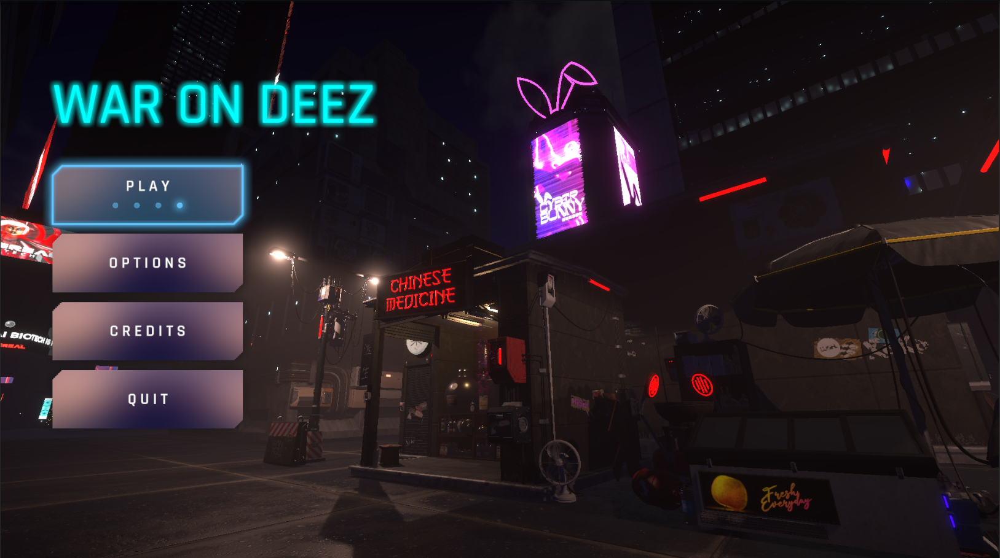

# War on Deez

WAR on DEEZ is a third-person cyberpunk-inspired game made with Unity 2021.3.18f1 HDRP. In this game, you control a player armed with a cyber katana in a 3D world where random enemies spawn. The aim is to fight off the enemies with up to 5 combo attack moves. The game features HD graphics with a detailed environment, cool characters and enemies, a modern UI, and a great soundtrack. 

> **Note**: Please note that this repository only hosts the scripts for the game and not the complete source code due to the use of non-redistributable assets.

## News

The Prototype of the game is available for download on [itch.io](https://aliqadir.itch.io/war-on-deez). 
This prototype is just a sneak peek of the main menu of the game, designed to test the performance of the game on different devices and platforms.
We want to make sure the game performs flawlessly on all devices and platforms, and we need your feedback to achieve this. Please download the prototype and fill out the [feedback form](https://forms.gle/imNYhXNQZByF5XKx9) to let us know your thoughts.

## Installation Instructions

The Prototype is available to play on Windows and MacOS.

> Note: The game is only compatible with Windows and Windows Store, with DirectX 11 or DirectX 12 and Shader Model 5.0, and MacOS (minimum version 10.13) using Metal graphics. Also, please be cautious when using the graphics settings, as ultra graphics were used on RTX 3060 for 1920x1080p 300Hz.

### Player System Requirements

### For Windows:

-   Download the compressed .7z file from the itch.io page.
-   Extract the contents of the file using a compression tool such as 7-Zip.
-   Open the extracted folder and run the .exe file to play the game.

### For MacOS:

-   Download the compressed .7z file from the itch.io page.
-   Extract the contents of the file using a compression tool such as Keka or The Unarchiver.
-   Open the extracted folder and run the .app file to play the game.

## Preview

## Requirements

-   Unity 2021.3.18f1 HDRP

## Usage

To use the scripts in your own Unity project, simply copy the desired scripts into your project's assets folder. The scripts are well documented and should be easy to understand.

## Contributing

This project is currently closed to contributions. However, you can fork the project and make your own changes.

## License

This repository is licensed under the [MIT license](./LICENSE.txt).

## Credits

Proper credits will be added soon.

## Acknowledgements

Thank you to Unity Technologies for creating such a powerful game engine and to the creators of the non-redistributable assets used in the development of this game. Proper acknowledgements will be added soon.

## Contact

If you have any questions or suggestuioins, feel free to contact me at [LinkedIn](https://www.linkedin.com/in/ali-qadir-1509b1226/) or [Instagram](https://www.instagram.com/oily.oli/).
